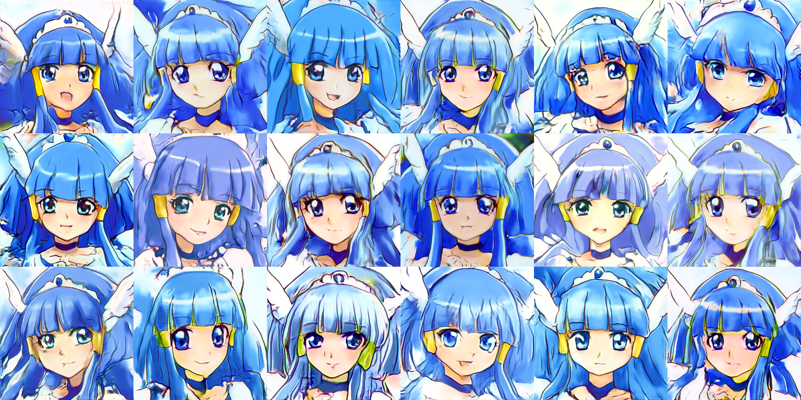
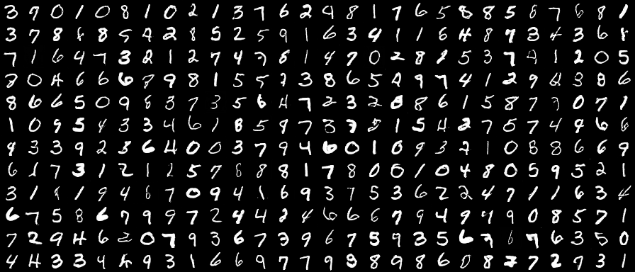
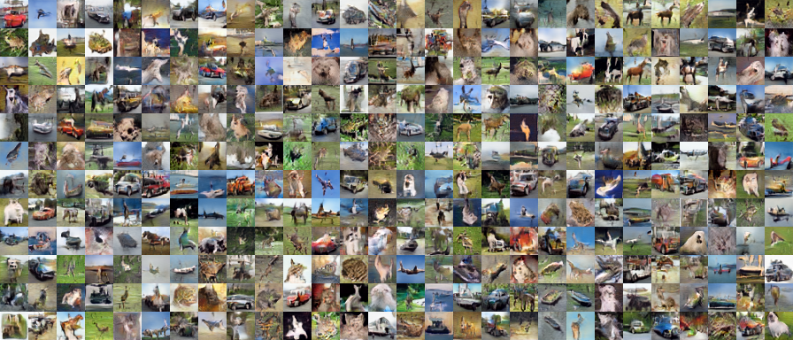
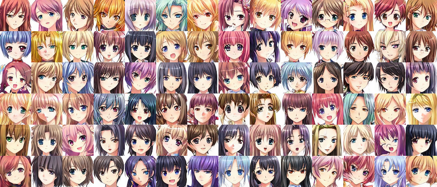

# Precure StyleGAN

Yet another StyleGAN 1.0 implementation with Chainer

We tried out to generate facial images of a specific Precure (Japanese Anime) character.

This project is finished and [will be continued here for better quality with StyleGAN 2.0 ADA](https://github.com/curegit/precure-stylegan-ada).

## Overview

StyleGAN is a generative adversarial network introduced by NVIDIA researchers.
Like PGGAN, its output image resolutions grow progressively during training.
This implementation supports generation ranging from 4x4 px (stage 1) to 1024x1024 px (stage 9) images.

Most of the implementation follows the original paper, but we have added some enhancements.
For example, we implemented an alternative least-squares objective introduced in LSGAN.
We trained the models with facial images of Cure Beauty (Smile Pretty Cure!, 2012) and other common datasets.

## Requirements

- Python >= 3.6
- Chainer >= 7.0
- Pillow >= 7.1
- Numpy
- H5py
- Matplotlib

### Optional

- Cupy
- OpenCV-Python
- Pydot (Graphviz)

## Script Synopses

- `train.py` trains StyleGAN models.
  Use the `-h` option for more details.
- `generate.py` generates images from a trained model.
  Use the `-h` option for more details.
- `mix.py` mixes styles from latent files.
  Use the `-h` option for more details.
- `animate.py` makes an animation of the analogy from a trained model.
  Use the `-h` option for more details.
- `visualize.py` draws an example of a computation graph for debugging (Pydot and Graphviz are required).
  It takes no command-line arguments.
- `check.py` analyzes the Chainer environment.
  It takes no command-line arguments.

## Results

### Cure Beauty (Curated, FID = 80.43)

### MNIST (Uncurated, FID = 1.14)

Try yourself: `python generate.py -g models/mnist.hdf5 -x 4 -c 256 16 -z 256 -n 100 -d mnist-images`

### CIFAR-10 (Uncurated, ψ = 0.7, FID = 18.61)

Try yourself: `python generate.py -g models/cifar10.hdf5 -x 4 -c 512 64 -t 0.7 -n 100 -d cifar10-images`

### Anime Face (Uncurated, ψ = 0.8, FID = 13.11)

Try yourself: `python generate.py -g models/anime.hdf5 -x 5 -c 512 64 -t 0.8 -n 100 -d anime-images`

## Bibliography

### Papers

- [Progressive Growing of GANs for Improved Quality, Stability, and Variation](https://arxiv.org/abs/1710.10196)
- [A Style-Based Generator Architecture for Generative Adversarial Networks](https://arxiv.org/abs/1812.04948)
- [Least Squares Generative Adversarial Networks](https://arxiv.org/abs/1611.04076)

### Implementation used as reference

- [Chainer implementation of Style-based Generator](https://github.com/pfnet-research/chainer-stylegan)
- [Chainer-StyleBasedGAN](https://github.com/RUTILEA/Chainer-StyleBasedGAN)

### Datasets for testing

- [THE MNIST DATABASE of handwritten digits](http://yann.lecun.com/exdb/mnist/)
- [CIFAR-10 and CIFAR-100 datasets](https://www.cs.toronto.edu/~kriz/cifar.html)
- [Anime-Face-Dataset](https://github.com/Mckinsey666/Anime-Face-Dataset)

## License

[CC BY-NC 4.0](LICENSE)
