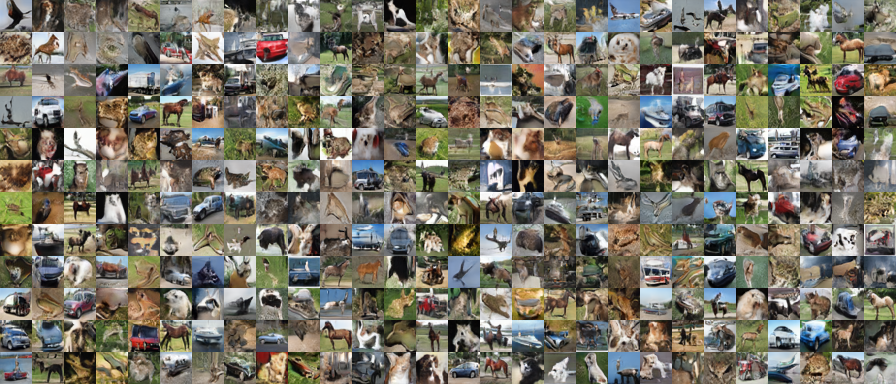

# Precure StyleGAN

## Requirements

- Python >= 3.6
- Chainer >= 7.0
- Pillow >= 7.1
- Numpy
- H5py

### Optional

- Cupy
- Pydot (Graphviz)

## Script 

- `train.py`

  train StyleGAN

- `generate.py`

  generate images of trained model

- `animate.py`

  make analogy animation

- `visualize.py`

  draw an example of computation graph (debug) (Pydot and Graphviz is required)

- `check.py`

  analyze chainer environment

## Results

### Cure Beauty

## Other Datasets

### MNIST

### CIFAR-10

### Anime Face

## Bibliography

- [Progressive Growing of GANs for Improved Quality, Stability, and Variation](https://arxiv.org/abs/1710.10196)
- [A Style-Based Generator Architecture for Generative Adversarial Networks](https://arxiv.org/abs/1812.04948)
- [Chainer implementation of Style-based Generator](https://github.com/pfnet-research/chainer-stylegan)
- [Chainer-StyleBasedGAN](https://github.com/RUTILEA/Chainer-StyleBasedGAN)
- [Anime-Face-Dataset](https://github.com/Mckinsey666/Anime-Face-Dataset)

## License

[CC BY-NC 4.0](LICENSE)
